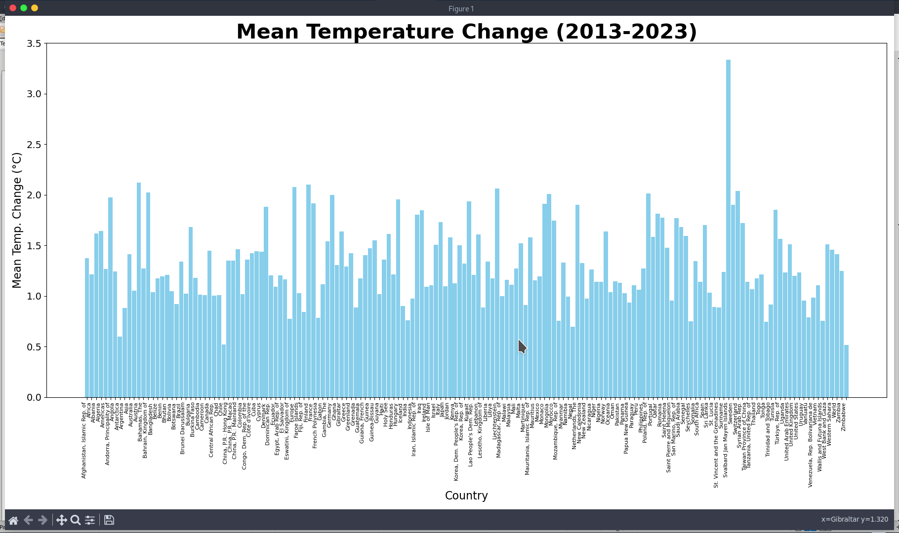
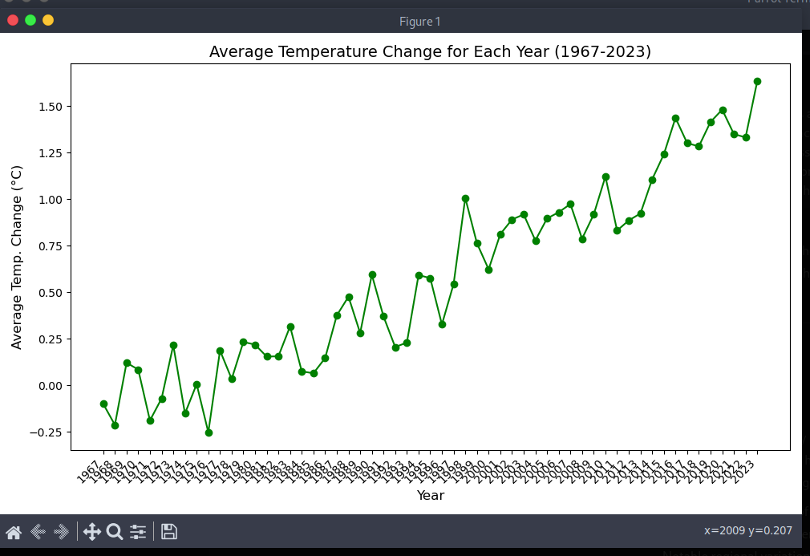

# Climate Change Data Analysis Tool

## Overview
This Python tool provides an interactive command-line interface for analyzing and visualizing global climate change data. The tool leverages a dataset of mean surface temperature changes from 1961 to 2023 and offers various functionalities for exploring trends, identifying regional differences, and understanding the impacts of climate change.

## Features
- **Plot Mean Temperature Changes Over the Past Decade:** Visualize the average temperature change for each country from 2013 to 2023.
- **Plot Yearly Average Temperature Changes (1967-2023):** Examine the global average temperature changes over the years.
- **Top 5 Countries with the Highest Mean Temperature Changes (1961-2023):** Identify and visualize the top-performing countries in terms of temperature increase.
- **Bottom 5 Countries with the Lowest Mean Temperature Changes (1961-2023):** Analyze countries with the least temperature changes.
- **Clean and Preprocess Data:** Handle missing values and calculate mean temperature changes for analysis.

## Prerequisites
- Python 3.6 or higher
- A CSV dataset (`ClimateChangeData.csv`) containing climate change data. Ensure the dataset follows the format used in the tool.

## Installation
1. Clone the repository:
    ```bash
    git clone <repository-url>
    cd <repository-name>
    ```
2. Install the required Python packages:
    ```bash
    pip install -r requirements.txt
    ```

## Usage
1. Place your dataset file (`ClimateChangeData.csv`) in the same directory as the script.
2. Run the script:
    ```bash
    python3 script_name.py
    ```
3. Follow the on-screen prompts to select the desired functionality:
    - `[01]` Plot the mean temperature changes over the past decade.
    - `[02]` Plot the average temperature change for each year between 1967 and 2023.
    - `[03]` Plot the five countries with the highest mean temperature changes from 1961 to 2023.
    - `[04]` Plot the five countries with the lowest mean temperature changes from 1961 to 2023.
    - `[05]` Exit the tool.

## Example Outputs
### Mean Temperature Changes Over the Past Decade


### Yearly Average Temperature Changes (1967-2023)


## Customization
- Modify the dataset pre-processing steps in the `HanddleMissingValue` function if your dataset requires different handling of missing values.
- Adjust visualization settings (e.g., colors, labels) in the plotting functions to fit your requirements.

## License
This project is licensed under the MIT License.

## Contact
For questions or suggestions, please contact:
- **Name:**Deneth Kavinda Mudannayke
- **Email:** denethkavindamudannayake@proton.me
- **GitHub:** [Your GitHub Profile](https://github.com/Deneth-Kavinda-Mudannayake/)
